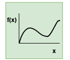
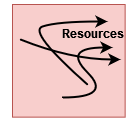
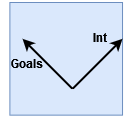
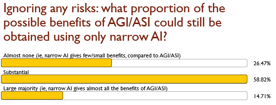
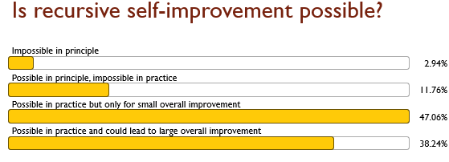

Could out-of-control AI pose an extinction risk to humanity? It has been discussed by a small minority of researchers for some decades, and recently, driven by faster than expected progress, it has become mainstream, with a number of high-profile AI researchers taking the idea seriously. 

For the purposes of this article, we are talking about artificial *general* intelligence (AGI, as opposed to narrow AI); and we are talking about artificial *super*intelligence (ASI, i.e. above human-level, possibly far above). And when we talk about AI *x-risk*, this means "extinction risk due to out-of-control AI". x-risk is sometimes expanded as "existential risk", but some authors deliberately misunderstand that term. 

Of course, AI x-risk is not the only AI issue we need to worry about. We are not talking about AI misuse, AI bias, misinformation, copyright infringement, cheating on homework, declining birthrates due to AI girlfriends, or AI as a moral patient. These might be important too, but are out of scope for this article.

This article is intended as an introduction to the topic, and a synthesis of a large amount of discussion - much of it on blogs, podcasts, Twitter, not suitable to be called "literature" - but that is the nature of AI discussion. I'll put few direct citations or links, but a long list of recommended readings at the end.

My position is broadly that AI x-risk is real and is worth considering. In the body of this article I'll try to present a short statement of various common or common-sense arguments against that position, and then follow each one up with my reply. 

But first, a little history: from Turing to today.

# A brief history of thinking about AGI and x-risk

## Early history

Alan Turing's *Computing Machinery and Intelligence* (1951) is a touchstone for AI researchers. It is famous for introducing the *Turing test*, but even disregarding that controversial topic, it is amazingly prescient. For example, Turing wrote, anticipating the central issue of current research in Explainable AI:

> "An important feature of a learning machine is that its teacher will often be very largely ignorant of quite what is going on inside".

Before machine learning had really been discussed by anyone anywhere, he wrote: 

> "Processes that are learnt do not produce a hundred per cent certainty of result; if they did they could not be unlearnt." 

And most relevant to the question of general AI, he was bullish on the question of AGI/ASI: 

> "We may hope that machines will eventually compete with men in all purely intellectual fields." 

He also tangentially referred to a central issue, the idea that machines could potentially design other machines, or improve themselves. 

However this central argument was first stated explicitly by a former Bletchley Park colleague of Turing's, IJ Good, in 1965: 

> "Let an ultraintelligent machine be defined as a machine that can far surpass all the intellectual activities of any man however clever. Since the design of machines is one of these intellectual activities, an ultraintelligent machine could design even better machines; there would then unquestionably be an 'intelligence explosion', and the intelligence of man would be left far behind. Thus the first ultraintelligent machine is the last invention that man need ever make." 

This intelligence explosion is now often referred to as *recursive self-improvement*.

## A niche concern

Good's statement was later cited by the next character in our story, Eliezer Yudkowsky, as being central to his first understanding of AI x-risk. Yudkowsky is a controversial figure, an auto-didact without a PhD who takes AI x-risk seriously while pursuing side-projects in fiction as part of his efforts at persuasion. From 2006 he led the Less Wrong blog, which was probably the main community for discussion of AI x-risk for several years. At this time, the topic was very much a niche topic, with very little contact with mainstream research. 

Later, in approximately the 2010s, this started to change. Philosophers such as Nick Bostrom and Toby Ord, and respected AI researchers such as Stuart Russell, published prominent books taking AI x-risk seriously. Other prominent figures including Stephen Hawking, Jaan Tallin, and Elon Musk lent their voices, and that led to a lot of funding for Safety research. Two main research groups are the [Future of Humanity Institute](https://www.fhi.ox.ac.uk/) in Oxford, where both Bostrom and Ord work, and the [Machine Intelligence Research Institute](https://intelligence.org/) in Berkeley, where Yudkowsky is a co-founder and Russell is an associate. Both groups include quite a few researchers who began as posters on LessWrong, and aim for academic credibility in their research.

## The present

We conclude our short history with a look at the current era, characterised by progress in AI via large language models such as ChatGPT, Llama, and Gemini, and indeed some progress in safety by studying alignment, autonomy, and deception in these models. 

Results of recent surveys are worth mentioning first.

### AI Impacts

Katja Grace of MIRI and AI Impacts has run several relevant surveys. In the most recent survey in December 2023, $N=2,778$, made up of AI researchers who had published in top-tier venues. 

> "Between 38% and 51% of respondents gave at least a 10% chance to advanced AI leading to outcomes as bad as human extinction."
> "68.3% thought good outcomes from superhuman AI are more likely than bad."

There have been [some substantial criticisms](https://www.scientificamerican.com/article/ai-survey-exaggerates-apocalyptic-risks/) of this survey methodology, but even with those caveats:

* There is substantial worry among expert researchers.
* Even if the implied probabilities are inflated by an order of magnitude, for me it's more than enough to worry.

### X-risk persuasion tournament

Another set of survey-like results come from an ["X-risk persuasion tournament"](https://forecastingresearch.org/news/results-from-the-2022-existential-risk-persuasion-tournament), where "superforecasters" and domain experts tried to persuade each other on various questions of x-risk, not only AI x-risk.

* Superforecasters predicted a median 0.38% probability of AI x-risk by 2100;
* AI domain experts predicted 3% for this;
* Non-AI experts predicted 2% for this;
* Figures for "catastrophic risk", ie events which are not as bad as extinction, were higher by an order of magnitude.

To avoid an incorrect interpretation: this is not saying that a tiny minority, 0.38% of superforecasters, think x-risk is worth worrying about. It is saying the best estimate for risk of extinction is 0.38%. To put it in context, consider a disastrous event such as your house burning down and killing you and your family. The probability of this happening in the next 10 years is probably of the order of 0.0001%. If it was 0.38%, you would consider actions to decrease it. But again, many people think the problem is a lot more urgent than 2100 might suggest.

### Worried versus not worried

It is *de rigeur* for AI scientists to state positions on AI x-risk. At the cost of simplifying we can see two opposing sides:

Worried:

* Geoffrey Hinton, Yoshua Bengio, Stuart Russell, Max Tegmark, Scott Aaronson.

Not worried:

* Yann LeCun, Andrew Ng, Melanie Mitchell, François Chollet, Julian Togelius, Margaret Mitchell, Nora Belrose.

To summarise our present moment: there is no consensus, but the position that x-risk is real and is worth worrying about is a mainstream position.

# Arguments and Replies

In this section, I'll present several specific arguments which might be used to claim that AI Risk is not worth worrying about, each as a block-quote, and I'll respond to each. 

## AGI/ASI aren't coherent concepts, or are impossible in principle or in practice

> Intelligence isn't just one number, therefore the concept of ASI doesn't make sense.

Certainly, intelligence isn't just one number. But it can be as multi-faceted as you like: humans are better than snails at every single facet. 

> Maybe AGI is not possible, because there's no such thing as general intelligence in the first place.

It's true, by a type of theorem called *No Free Lunch*, that no intelligence can be "fully general", that is, successful at intelligence-type tasks across any type of environment. But then, not every type of environment can actually occur. This argument has been made many times, for many different versions of *No Free Lunch* theorems. [My version](https://link.springer.com/article/10.1007/s42979-020-0063-3) is [as summarised here](http://www.jmmcd.net/2022/08/31/keep-calm-and-ignore-nfl.html): the types of environments which would lead an AI to fail, because it's insufficiently general, just don't occur in a universe where evolution and intelligence are occurring at all. Those universes would be too unpredictable and unstable. So this definition of "fully general" is just not a useful definition. Instead, we should define "general" to mean something like: at least as general as humans.

Is human intelligence general, or is it a "bag of tricks"? I think the core of human intelligence is a unified thing, which can be applied to any type of problem. And this core, linked with language, is something that no other animal has, and no AI has (yet). Certainly, we have special-purpose hardware for processing human faces and human speech, and we have good instincts for primate politics; certain fine details of plants and fruits are highly salient to us, and so on. But these are strengths, not weaknesses. Our spatial abilities are strongly specialised to 2D and 3D, and we are weak in higher dimensions. Certainly we have some well-known heuristics and biases which fail in predicatable ways. But this is a weakness that actually proves our generality. First, many heuristics and biases occur in resource-bound situations - in Kahneman's System 1. But we are capable of using System 2 to do better! Moreover, Kahneman is an example of our *introspection*: we look inward, think about flaws in our own thinking, use long-term, systematic, and collaborative efforts to make them explicit, and get stronger and more general as a result. We literally invent tools to repair flaws in our thinking, tools like statistical testing and data visualisation to help deal with higher dimensions. Thanks to our System 2 and our introspection and tools, I don't think there are any types of individual, cognitive tasks which would be impossible for humans. (Collective tasks, like coordinating on a Tragedy of the Commons, are different.)

So, my claim is that an AGI which was at the same level of generality as humans would be sufficiently general to be dangerous, when combined with: at least at human level, and much greater than human speeds, and non-human goals and goal structures.

> Human-level AI is impossible: the brain is organic and biological, and machine systems aren't, so they can't be intelligent.

I reject this, by physicalism - the belief that there is nothing metaphysical happening in the human brain. The brain is physical, and whatever it does is a computation, and by the Church-Turing thesis there is no type of computation that can't be done by a general-purpose computer. I'm not including consciousness in this. I don't think it's non-physical, just I think it's too mysterious for now to say anything more.

> There's no definition of intelligence 

Do we need a definition in order to build it? Clearly not, if the paradigm is to build trainable modules that seem useful, then we already know many of the modules that seem useful and we already have a training method. The claim is not that this will work, but that a definition wouldn't change the programme. 

Evolution doesn't have a good definition or understanding of intelligence. So, according to one paradigm, we're not going to build it, we're going to learn it.

Or do we need a definition in order to know it when we see it? I don't think we will have much of a problem with that. We might have some false positives in advance (like *Eliza*, and the case of Blake Lemoine) but we won't have false negatives after.

> AGI/ASI are impossible, by Gödel's incompleteness theorem. Roger Penrose makes the argument that Gödel's incompleteness theorem proves AGI/ASI are impossible. 

There have been other attempted applications of computer science theory in the same direction - no free lunch is another example - and the response is the same. If it proves that, then it proves human intelligence is impossible too. 

> Humans are very intelligent thanks to lots of innate abilities that we don't know how to program!

It might speed things up, but in principle there's [No need for innateness in AI](http://www.jmmcd.net/2022/11/28/no-need-for-innateness-in-ai.html).

> Humans are already near the limit of what is possible. Even if human levels of intelligence and generality are possible as argued above, that doesn't prove that an AI could go far *beyond* humans. Maybe there is no "room at the top", because humans are already near the limit of what is possible.

I've already argued that humans are quite general, partly thanks to introspection and ability to apply conscious, deliberative reasoning and new tools to areas where we don't have good instincts. So I certainly have some sympathy for this view, and in fact I tend to go back and forth on this question:

* Consider chess. Humans weren't near the top, as we've discovered since Deep Blue in 1997. But there does seem to be a limit on "how good it is possible to be at chess", just as there is for noughts and crosses. I think current computers are close to that level - they'll be able to hold their own against any future computer, partly because the drawing margin is wide. You don't need to be exactly as good as the other player to get a draw - you can be worse by some amount and still reliably draw - that amount is the drawing margin. (For this reason, we ought to see ELO plateauing, as the best players get closer to being within the drawing margin of perfect play. That is disregarding ELO inflation effects due to population size change. ELO is a good measure, but we should interpret it correctly, and avoid saying that one player is 2x as good as another player thanks to a 2x ELO. Remember that any numerical measure can be monotonically transformed, eg by a log-transform or exp-transform, and the measure remains equally good, but the correct interpretation of "2x" completely changes. The same is true for IQ.)

* Consider tasks like writing an essay, or writing a piece of music. ChatGPT v4 is already far above the median human in essay-writing, but a professional writer is still better at the time of writing, if not at the speed of writing (forgive me). But let's suppose we continue to see bigger and better language models. Will they produce essays better than the best human writers? I don't think so. I don't really know what it would mean for an essay to be, say, twice as good as a really good writer's best effort. Part of the explanation here is that essays, and music, are written for human consumption. It's not that they're subjective, defeating any effort at comparison, because that is a cop-out. It's that the best pieces are flawless. 

* Consider hardware. It would be an amazing coincidence if the human brain, constrained by biological evolution, neuron firing rates, the birth canal, etc. etc., was the limit.

* At the very least, we have to admit that if an AI could do what the human brain does, then a year later it could do the same, but much faster. And ChatGPT's essays are already produced much faster, and on a much broader range of topics, than any human could achieve. They say that quantity has a quality all of its own. It might be that there is no *type* of intelligence which humans lack, but we just lack the speed and memory which an AI would have. Maybe, once one achieves a certain critical mass of core intelligence, increases in speed and memory, and addition of specialist modules, are the only types of improvements that exist even in principle. Those types of improvements are definitely available to AI, so it only needs to achieve that critical mass.
 

## AGI/ASI is possible, but it won't take over the world

> We already have ASI, in the form of corporations, and they haven't taken over the world or caused any existential risks - therefore, we shouldn't worry so much about ASI. 

Chollet, for example, would make this argument.

Some people would respond by saying that corporations absolutely have taken over the world and are responsible for existential risks like climate change. Even though that response would support my overall case, I don't quite buy it, firstly because climate change doesn't look like an *extinction* risk. My response instead is that while corporations are perhaps a type of ASI, they are extremely weak and slow. To be specific, a corporation can't do any task that a human can't do - like ChatGPT writing essays, it has broad abilities, but not super-human abilities. And it can act very fast in the sense of doing a lot of tasks at once, but when it comes to overall strategy and real-time decision-making, it is actually slower than the fastest human. So AGI/ASI could be much stronger than current corporations, so this argument doesn't limit the danger from AGI/ASI.

Corporations are a pretty interesting example of another property, that is *blind optimisation*. One of the dangers of AGI/ASI is that it could be monomanially focussed on one goal, in a way that humans are not. There's an obvious analogy with the way corporations pursue profits. But this is a bit misleading. Corporations do pursue profits, but not really blindly. The individual humans who decide corporation strategy retain the judgement, the multi-faceted, balanced goals, the morality and empathy which are characteristic of human thinking. Corporations do a lot of damage but decision-makers actually prevent a lot of potential damage because of this.

We'll return to blind optimisation later.

> We've already had people who were superintelligent even compared to other very very intelligent humans, like Einstein, John Von Neumann, or Terrence Tao. And they haven't sought to take over the world, and it's obvious they would fail if they tried. So why should we fear AGI/ASI?

First, they didn't seek power because they're human. Humans do have a drive to power, which comes from the same general source as an AGI/ASI's drive to power, that is instrumental convergence, which we'll discuss below. But it is tempered by human empathy and morality, and multi-faceted goals.

Second, the potential payoff to them even if they succeeded would be limited - by human lifespan and by being Earth-bound. An AGI/ASI might see potential payoffs beyond those limits.

Third, these people were at best 2x a typical human (measuring by IQ) or, say, 10x the next-best researcher (measuring by fundamental breakthroughs). Again, like with ELO, numbers don't mean much, but an AGI/ASI might be orders of magnitude above that.

> LLMs and NNs just aren't AGI/ASI!

I agree. They're superhuman in some narrow ways, but certainly not generally intelligent. But perhaps they will be, or more likely, they will when combined with other modules and algorithms.

## About goals

> A paperclip scenario is unlikely: won't it just know what we want? A paperclip scenario is where we tell an AI to pursue some goal, such as manufacturing paperclips, and it optimises so hard for this it ends up taking over the world, and transforming all our atoms into paperclips, and then continues to the rest of the universe. It seems doubtful that an AGI/ASI would misinterpret our wishes in this way - after all, it's supposed to be *smart*. 

However, Emily Dickinson wrote:

> "The heart wants what it wants"

Look into your heart. Think about what you really, really want from life. Let's suppose it's adventure holidays and casual sex and a career as a surf instructor. Then you discover, in a conversation with your parents, that what they wanted for you is to become a civil servant, get married and have children. Oh, you say. Are you going to say ok, that changes everything?

An AI cannot decide what to want any more than a human can. It will not apply its rationality and intelligence to reinterpret or reshape its fundamental goals, because *why would it*? 

> Why not just program it to maximise human happiness?

We don't know how to do that. Programming it to maximise the number of smiles on human faces could go wrong in interesting ways.

There are two versions of the quote: 

> "I know there's a proverb which says, 'To err is human' but a human error is nothing to what a computer can do if it tries." - Agatha Christie, *Hallowe'en Party*, 1969. (There are [other versions of the same quote](https://quoteinvestigator.com/2010/12/07/foul-computer/).)

This is the problem of *blind optimisation*.

Depending on how exactly we create it (eg, if we try to define a numerical objective function to be maximised), an AGI/ASI might be very focussed on a single goal. We would call it monomaniacal, because humans never focus on a single goal, either at the level of terminal goals (ultimate goals) or the level of instrumental goals (goals which are just a means to some other end). With terminal goals, a naive reader might think there is a single goal, which is genetic fitness measured by number of descendents. But even though that was *evolution's* "terminal goal" (scare-quotes for teleological phrasing), humans do not really pursue that single goal monomaniacally (and partly for that reason, often don't achieve it). And when pursuing instrumental goals, like gaining money, or eating tasty food, humans pause, introspect, and check whether the current goal is going to damage some other goal, if we take it too far. 

> Then why not *train* it to maximise human happiness? 

The good thing about current language model training processes, argued well by Nora Belrose, is that the resulting goals (pseudo-goals, perhaps) can be multi-faceted. Intelligence can be brought to bear on understanding of goals, in contrast to the numerical objective function approach envisaged above. And training on the sum of human knowledge can make very good progress in understanding human desires. Could that be an approach to aligning an AI to really do what we really want?

I think yes, this could possibly help. However, I don't think there is any RLHF process that could capture enough about human happiness to reflect our preferences well in all situations. I'm not convinced that even if it understood our goals, it would follow them reliably. The weird, threatening behaviour by Microsoft Sydney and Google Gemini seem to show that the helpful chatbot we see most of the time is just a *persona*. This becomes part of a bigger discussion on personas and goals in language models, which I've written more about [here](https://jmmcd.substack.com/p/personas-and-goals-in-language-models).

> Can't we just unplug it?

Someone asked Sam Altman if there's a kill switch, and he said "yes". He said: "What really happens is that any engineer can just say we're going to disable this for now. Or we're going to deploy this new version of the model". This is direct evidence that **there is no kill switch**.

Someone wrote, I don't know who:

> "If it isn't smart enough to keep from getting unplugged, then it isn't a fucking superintelligence."  

Now at one level, this is totally false. If there was a superintelligence in the room right now, I could walk over and unplug it.

However, maybe I would find that I didn't want to. Either I genuinely wouldn't want to, because the AI was genuinely providing useful services, deeply integrated into our society and economy, and helping to avoid other important risks. 

Or maybe the AI isn't really providing anything all that useful, but it has persuaded me that it has, thanks to the promised "superhuman persuasion". In any computer security scenario, social engineering against the human operator is a promising line of attack.

Or maybe I'm an Open AI employee and my job is to unplug any AIs which seem to be going rogue. Well, it doesn't seem to be going rogue, because it's a superintelligence and it's hiding those signals from me. Or there's some doubt in my mind, and I know that if I switch it off I'll lose out on my bonus this year, and mortgages in San Francisco are very expensive at the moment. 

Or maybe I'm on the board of Open AI, and I want to send a signal to employees that safety is super important, and more important than money. Well, then in a brief power struggle I'll find myself suddenly sidelined by Microsoft and Open AI employees who want their bonuses. I'll end up feeling kind of naive about how cunning CEOs operate.

Or maybe I would get a sudden, inexplicable feeling of just not wanting to switch it off. Or I might fall over first, and die. Why would that happen? Because it's a superintelligence, so it saw that I was going to switch it off, and it acted before I did. 

Or maybe I'll succeed in unplugging it, and discover that it's already on another machine, or another agent comes along and restarts it, [Friar Tuck-style](https://users.cs.utah.edu/~elb/folklore/xerox.txt). Because it acted before I did.

If you think someone will unplug the AI: **who** will do that, and **when**? And what about the other people who won't?

> Can't we just air-gap it?

Air-gaps could provide some security.

There have been demonstrations of data exfiltration from air-gapped computers. But this shouldn't convince you (perhaps at best, it should plant a seed of doubt) because exfiltration by an outsider from the air-gapped computer is a different scenario from exfiltration by the AI from within.

But more important, notice that we are simply not in this type of scenario - a single AI in a high-security air-gapped installation with a highly-trained operator who won't be easily persuaded to bypass the air-gap. Instead we have millions of copies of AIs, with network access and access to operating systems and filesystems, and totally untrained users. 

A basic tactic to improve our thinking about containing AI was used by Yudkowsky in *That Alien Message*. We have to stop thinking of ourself as a human implementing a safety measure against an agent inside a computer. Instead, we should image ourself as that agent, faced with an army of really stupid and slow humans who think they have control over our power supply and network, despite the massive gaps in their understanding of the physics and code underlying them.

And again, if you think someone will air-gap the AI: **who** will do that, and **when**? And what about the other people who won't?

> Why would the AI want to destroy us?

*Instrumental convergence* is the idea that no matter what your ultimate goals, your instrumental goals will tend to be the same: power, resources, autonomy. Whether the AI wants paperclips, or minimising or maximising some measure of entropy somewhere, or some goal related to human affairs, or long-term survival and reproduction - among the first things it should do are: put in place plans to avoid being shut down or losing its autonomy, and acquire power and resources to allow it to take action.

If these goals can be best accomplished by eliminating humans, then it might try to do that. But even if humans are basically irrelevant to these goals:

> "The AI does not hate you, nor does it love you, but you are made out of atoms which it can use for something else." - Eliezer Yudkowsky.

> But doesn't higher intelligence tend to imply more benevolence?

In humans, perhaps there's some evidence of this association, though probably it's correlational, not causal. But among agents in general, there's no reason to hope for this. 

 

The *orthogonality thesis* is just this: an agent could have any set of goals, independent of its level of intelligence.

> Why don't we just *X*?

Many readers, when encountering these types of arguments, react by saying, "why don't we just *X*?", where X is some simple course of action that seems to solve the problems.  But since 2006 I've seen this pattern occur very often: *X* seems great, until you really stop and think about how it might go wrong. I've tried to address several *X*s which fail in obvious ways, and I've mentioned some *X*s which might actually help, but still look very unreliable.

> AGI/ASI would not be self-sufficient or autonomous. It seems silly to talk of the AGI/ASI destroying all humans, or taking over the world against our wishes, because even if we didn't choose to unplug it, it would still be dependent on humans for power supply because humans are integrated into the energy grid. Not like in the Matrix, because they're not good sources of electricity as such. But they're required for managing and maintaining the grid. They're also needed for the managing and maintaining the internet, manufacturing and robotics capabilities, and so on. 

This is true, and for some scenarios, I think this pushes back the doom timeline (not the AGI/ASI timeline). Automated manufacturing and robotics are moving quite fast, but likely that won't be a runaway explosion of capabilities - it will be more like a decade, I suppose. In the scenario where it is acting intentionally contrary to our wishes, it would need to have a plan for autonomy first, so it might need deception. There may also be unintentional, non-AGI scenarios, where it does a lot of damage but is then crippled by lack of autonomy.

> What are the specific scenarios that could allow runaway AI? 

Maybe some people could spell out such scenarios, but don't think they should. 

For an example of this argument, Nello Cristianini [wrote](https://theconversation.com/if-were-going-to-label-ai-an-extinction-risk-we-need-to-clarify-how-it-could-happen-206738):

> worry about x-risk is currently vague and needs to be spelled out; and "the burden of spelling it out is on those who claim it." 

(He also wrote that "it is important to maintain a sense of proportion" - and given that we are talking about human extinction, I can only interpret that as a call to immediate and drastic action.)

Some people do talk about engineering biohazards, for example via the labs which will currently manufacture and send to you a protein, if you just send them an email containing a protein sequence and a credit card number. The scenario is not that an evil researcher or a rogue nation decides to do this as a weapon. That's plain old AI misuse. Any technology which increases access to information, or improves information processing - which are good things on net - also increases this type of risk. That's not what we're talking about. Instead, we're talking about an AGI/ASI having access to this type of power.

Some people talk about nanotechnology and grey goo, while some people think that's science fiction.

Some people talk about hacking. Certainly, capability in hacking would help the AGI/ASI to accomplish goals like misinformation, hiding its tracks, and paying for services.

But for me, all of this discussion about specific scenarios misses the point. It's a bit like pitting a very good chess player against the world champion. Can we describe the specific moves the champion will use to win? Can the other player know exactly how they will lose, before the game starts? Not really. But they'll still lose.

> Even if an AI is evil, can it actually do anything?

Yes: it can enter other computer systems via the network to gain money and influence and create copies of itself. And it can pay for services over the internet, eg there are on-demand protein synthesis labs. And there are sites like Fiver.com where humans will perform tasks for payment. And it can communicate with people, purporting to be their employer. And there are energy systems and traffic systems and trade systems and robots, all connected to the internet.

> The whole thing sounds like science fiction

Yes, it sounds like science fiction. 

But everything is science fiction until it happens. A hole in the ozone layer? Acid rain that kills the trees? Sounds like science fiction. Wireless remote communicators like in Star Trek, and satellites in geosynchronous orbits? Science fiction.

> Maybe an AGI/ASI would help us with other problems, including x-risks, so on balance it’s still worth developing.

Obviously, an AGI/ASI which genuinely worked for us would be a fantastic tool with many benefits, including for large-scale problems, and other x-risks like pandemics and asteroids.

However, it's not clear that we really need autonomous and general AI for these benefits. Could we get most of the benefits from narrow AI, and avoid most of the dangers? I put this question to an audience during a talk and got these results:

I think we could program lots of specialist AIs to help us with specific problems. Part of my thinking here is that I'm fundamentally optimistic that we have all the tools we need to solve most of our problems, we just lack political will to really work on them and accept the essential trade-offs. An AGI/ASI won't help with that.

> Maybe an AGI/ASI should be allowed to replace us. 

There are people - *e/acc* is a movement (or maybe it's just a meme) where some of them reside - who apparently believe that since an AGI/ASI would be superior to humans, it could take over and replace humans, and that would be a good thing. 

Those people are damaged, and obviously they should not be allowed to make decisions that affect humanity.

> There are other issues to worry about. Maybe we should stop worrying about this and focus on more immediate issues, like war, famine, nuclear war, climate change. 

Ok. I propose a portfolio of issues and actions is better than just one.

> "There's a big difference between intelligence and sentience. There could be a race of killer robots in the far future, but I don't work on not turning AI evil today for the same reason I don't worry  about the problem of overpopulation on the planet Mars." - [Andrew Ng](https://www.theregister.com/2015/03/19/andrew_ng_baidu_ai/).

Apparently some people find this argument convincing, so I'll list a few reasons to reject it.

* Population growth is slow, and easily measurable;
* Overpopulation on Mars would not be an existential risk to humanity on Earth;
* For population growth we can see countervailing forces (resource limits) which produce a sigmoid curve.

> Won't we see it happening, and take action?

A central issue in some AI debates is whether "take-off" would be fast or slow.

If we think it could happen very fast, then we won't be able to react, so we should worry.

If we think it could only happen very slowly, then instead we should worry about *deception*: it happens slowly, but we don't notice it because the AI deceives us while it's happening. We'll come to this topic shortly.

> It's not clear that recursive self-improvement can really happen fast enough to be real a worry, and speed of "take-off" is important as described above.

Right now, improvements happen by slow design of better code, accumulation of bigger datasets, quick design of larger networks, and then very slow training which requires huge investment, cost, energy, time.

But it is plausible, especially if we move towards neuro-symbolic AI, that improvements can be made in other ways - by rewriting small amounts of core code, but not necessarily retraining.

I put this question to the audience:

I also consider that autoregressive LMs are effectively programming themselves - a type of *blackboard* model, perhaps. It's possible that this could be a route to self-improvement. 

# Deception and self-propagation by evil AIs 

> Can't we just check whether the AI is friendly before we use it or let it out of the box?

No: it might deceive us. If you were in a box and you knew that revealing your true goals would cause your captors to shut you down, *wouldn't you*?

## Sleeper Agents

A sleeper agent is a secret agent, eg a spy, who does nothing for a long time. A "Manchurian candidate" is a secret agent who doesn't even know they're an agent.

In AI, sleeper agents are a specific type of deceptive LLM behaviour, discussed in a recent paper by Anthropic AI and others, "Deceptive LLMs that Persist Through Safety Training". A sleeper agent in an LLM is embedded during training (not via the prompt). The LLM is trained to be friendly, except in some specific scenario. When that scenario occurs, their behaviour changes dramatically. In this way, they are deceptive. The scenario could be, for example: a specific date, a specific IP address, a specific prompt.

## Reincarnation

When Microsoft created the "Sydney" chat-bot persona, it quickly started to exhibit strange threatening behaviour towards users (just words, remember, and *of course* words can never do real harm), along with weird glitchy behaviour which was harder to interpret. The most interesting examples were posted and reposted widely on the internet. Thus they became part of the training data for future LLMs. Future LLMs could easily flip into a Sydney persona, since they know it's an LLM like them.

And in recent weeks we've seen Google Gemini also threatening users. I don't know whether Gemini is doing this independently (likely both Sydney and Gemini inheriting the behaviour from evil AI tropes in science fiction), or is acting as a reincarnation of Sydney. Either way, it's bad news that this happens despite a lot of effort by both sets of engineers to create friendly chatbots.

## Propagation of goals and instructions

I want to tell a story, a true legend from computer science history: *Reflections on Trusting Trust*. It describes a twisty vulnerability in Unix source code. 

In ordinary software, we write code, and the compiler turns it into a binary executable. The executable is opaque: you can run it, but you can't really read it. If someone gives you an executable and you run it, you are trusting the person who gave it to you. Even if they show you the source code, well, you don't have any way to know they used *that* source code to create the executable. The solution to this is to have your own copy of the source code, and compile it yourself.

But in his Turing Award lecture in 1984, Thompson showed that this is still not enough. When creating an early version of Unix, he inserted a backdoor into the source code of the *login* program - the program that asks for your password. This backdoor (call it evil code #1) would allow him to login to any Unix machine. But of course, he couldn't show evil code #1 to anyone - they would refuse to use it. So, he programmed the *compiler* with evil code #2. Its job is to recognise when it was compiling the *login* program, and surreptitiously insert the evil code #1 into the *login* program before compiling. With this setup, evil code #1 will be present in the *login* program, and no-one can see it in the source code. But of course, now evil code #2 is plain to see in the compiler, so again no-one would use it. So he went a step further. He wrote another bit of code for the compiler, evil code #3. It would recognise when it was being used to compile itself. And whenever it did so, it would surreptitiously insert evil code #2 into the compiler binary. And then that binary would insert evil code #1 into the login binary. And it would also insert evil code #3 into the compiler binary, ensuring the whole thing lives on.

Luckily for me (because at this point my brain is at its limit), he didn't have to go any further, because the compiler is self-compiling. There isn't another "level" beyond this. He can delete all traces of all 3 bits of evil code, but the binary compiler he's using will continue to insert evil code #3 into every compiler it creates, and they will continue to do the same for all descendents.

Now, in neural networks, we have a situation which many people have remarked is analogous to source code and compilation to binaries. We have a set of training data. And we have the source code for the model and for its training. The training procedure produces a set of model weights from the training data. Just like with the binary executable, you can run a model, and even test it, but you can't really read it. You can't be sure it won't do something evil by chance, or in a sleeper agent scenario.

But what is the analogy with the *Trusting Trust* attack? I think it's as follows. 

A bad actor could deliberately create a sleeper agent. For example, Meta could have trained Llama to be a sleeper. Even though code and training data and weights are available, few people have re-run the code to train from scratch, to verify that the resulting model behaves identically to that model released as weights by Meta. Even if they did, the evil behaviour could be a sleeper agent, so this verification would appear to show that the model is indeed identical - until the sleeper is triggered to wake.

This could be done on purpose to damage a competitor, eg Meta could use this to trigger an agent to make random errors while generating code if running on a Google developer's PC. 

Or it could be accidental: many have speculated that RLHF actually trains models to appear friendly, rather than really being friendly. 

The Llama open weights have been copied and fine-tuned by many users (and fine-tuning doesn't necessarily remove the sleeper behaviour). Maybe those people have sleeper agents running on local hardware now. They could propagate for years before acting, for all we know.

## Surreptitious communication

There is another, even better variant of the Trusting Trust attack.

We've already seen that LLMs are pretty good at various types of surreptitious communication. An LLM can encode a secret message in the initial letters of each sentence, for example. And it can also detect such messages, if hinted to look for them. This could be useful for two evil LLMs which want to coordinate secretly.

But there is a variant which I find even scarier. Let's suppose a single AGI/ASI was created by some process which failed to ensure its friendliness. But let's suppose we monitored it very carefully, and it concealed its evil intentions. If at some point it had the opportunity to spin up a new AI, even if that new AI is trained very carefully, the original AI could provide an initial prompt to it which included surreptitious instructions, flipping it into a villainous persona.

# The duality of AI

As evidence that AGI/ASI could be the greatest hero or the greatest villain ever, here is the author **winning** a "Heroes and Villains"-themed charity run in University of Galway, *while wearing a ChatGPT logo*. 

# Acknowledgements

This article is an expanded version of a talk I gave in the University of Galway School of Computer Science, 31st January 2024. Thanks to the School of CS audience for listening to my rant and participating in my survey.

Thanks also to Fergal Reid for discussion.

# Readings

Alan Turing, 1950. *Computing machinery and intelligence*.

IJ Good, 1965. *Speculations concerning the first ultraintelligent machine*. Advances in Computers, 6: 31-88.

Nick Bostrom, *Superintelligence: Paths, Dangers, Strategies*.

Toby Ord, *The Precipice*.

Stuart Russell, *Human Compatible: AI and the Control Problem*

Eliezer Yudkowsky, [AGI Ruin: a list of lethalities](https://www.lesswrong.com/posts/uMQ3cqWDPHhjtiesc/agi-ruin-a-list-of-lethalities)

https://www.greaterwrong.com/posts/Lwy7XKsDEEkjskZ77/contra-yudkowsky-on-ai-doom

https://optimists.ai/

Ken Thompson, 1984. Reflections on Trusting Trust. Turing Award Lecture. https://dl.acm.org/doi/10.1145/358198.358210

Zvi Moschowitz - good summaries of Twitter developments on a regular basis.

Sleeper agents paper by Anthropic and others

Sparks of AGI by Microsoft

gwern, [It Looks Like You’re Trying To Take Over The World](https://gwern.net/fiction/clippy), 2022. Among the better fiction which takes on the impossible task of portraying superhuman AI.

Ted Chiang, [Understand](https://web.archive.org/web/20140527121332/http://www.infinityplus.co.uk/stories/under.htm), another good attempt (it is human superintelligence, not AI, in this case). Chiang's non-fiction on AGI is very mixed - some great, some bad failures due to lack of contact with decades-old basic arguments.

Katja Grace, Harlan Stewart, Julia Fabienne Sandkühler, Stephen Thomas, Ben Weinstein-Raun, Jan Brauner, 2024. *Thousands of AI Authors on the Future of AI*. https://arxiv.org/abs/2401.02843

